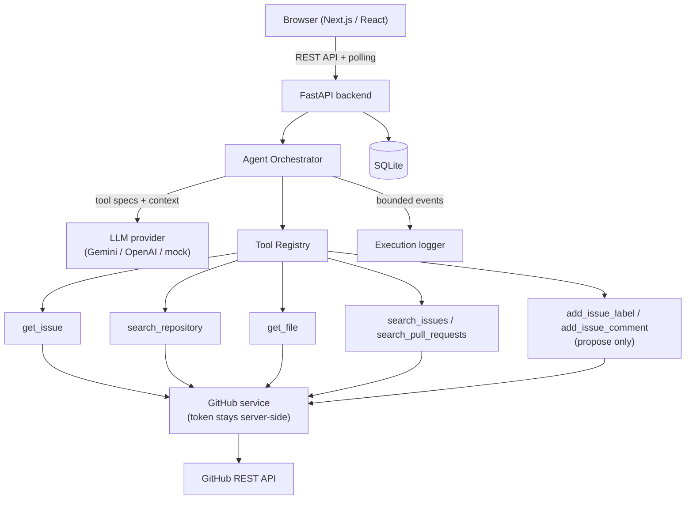

# GitPilot — AI GitHub Issue Resolution & Triage Agent

Given a GitHub repository (`owner/repo`) and an issue number, GitPilot runs an
AI agent that **autonomously investigates the issue**: it retrieves the issue,
searches the repository for relevant code, inspects files, looks for related
issues/PRs, reasons over the evidence, and produces a **validated, structured
resolution report** (summary, category, priority, root cause, evidence,
affected files, resolution steps, test plan, confidence, warnings).

The agent is a **real tool-calling loop** — not a hard-coded workflow. The LLM
decides which tools to call based on the issue and the evidence gathered so
far, within strict safety limits (step budget, execution timeout, bounded tool
output, validated tool arguments). Any GitHub **write action** it proposes
(labels / comments) is only executed after **explicit user approval** in the UI.

## Problem statement

Triaging a GitHub issue requires context that lives in several places: the
issue thread, the repository source, and related issues/PRs. GitPilot automates
that context gathering with an agent that uses tools like a developer would —
look up the issue, search the code, read the relevant files, check related
history — and then writes up an evidence-based resolution plan instead of a
hallucinated answer.

## Features

- **Autonomous multi-tool agent** with real function/tool calling
- **Structured, validated output** (`ResolutionReport` Pydantic schema) with
  `confirmed` vs `hypothesis` evidence labels
- **Safety limits**: max tool calls, execution timeout, per-tool timeouts,
  bounded tool output, validated tool arguments
- **Approval-gated writes**: label/comment proposals require an explicit
  Approve/Reject; nothing is written to GitHub otherwise
- **Live execution timeline** in the UI (safe, concise status events only)
- **Persistence**: analyses, execution events, reports, and approvals in SQLite
- **Provider-agnostic LLM layer**: Gemini (default), OpenAI, and a
  deterministic mock for offline demos/tests — swapped via configuration,
  never code changes

## Architecture



**Agent workflow:**

```
Issue → get_issue (context) → LLM decides next step → tool call
      → bounded observation appended to context → repeat until the model
      has enough evidence (or limits hit) → final JSON → Pydantic validation
      → persisted report + approvals → UI
```

The sequence is **not** hard-coded: the orchestrator only provides the tool
specs, executes whatever the model requests, and feeds results back. A test
(`test_context_driven_tool_selection`) proves the loop honors dynamic,
context-dependent tool choices.

## Tech stack

| Layer     | Technology                                        |
| --------- | ------------------------------------------------- |
| Frontend  | Next.js 15, React 19, TypeScript, plain CSS       |
| Backend   | Python 3.11+, FastAPI, Pydantic v2, Uvicorn       |
| AI        | Gemini API (tool calling) via `google-genai`; OpenAI alternative behind the same abstraction; deterministic mock provider |
| GitHub    | REST API via `httpx` (server-side token)          |
| Database  | SQLite via SQLAlchemy 2.0                         |
| Testing   | pytest (109 tests), TypeScript compiler, `next build` |

## Project structure

```text
.
├── backend/
│   ├── app/
│   │   ├── main.py            # FastAPI app factory + error handlers
│   │   ├── api/routes.py      # REST endpoints
│   │   ├── agent/             # orchestrator loop, context, prompts
│   │   ├── tools/             # registry + GitHub tools (bounded, validated)
│   │   ├── services/          # GitHub service, LLM providers, analysis service
│   │   ├── models/            # SQLAlchemy models + resolution schema
│   │   ├── schemas/           # Pydantic API models
│   │   ├── db/                # SQLite engine + repository layer
│   │   └── core/              # config, errors, logging, validation
│   ├── tests/                 # 109 pytest tests (mocked GitHub + LLM)
│   ├── requirements.txt       # runtime dependencies
│   └── requirements-dev.txt   # + pytest
├── frontend/
│   └── src/
│       ├── app/               # layout, page (main screen), global CSS
│       ├── components/        # form, timeline, report, approvals, history
│       └── lib/               # typed API client + API types
├── .env.example               # documented env vars (placeholders only)
└── .freebuff/                 # project specification
```

## Environment variables

| Variable                    | Required | Default            | Purpose                                              |
| --------------------------- | -------- | ------------------ | ---------------------------------------------------- |
| `GITHUB_TOKEN`              | yes*     | —                  | Server-side GitHub token (`repo` read scope; `issues:write` only if you want approved writes) |
| `LLM_PROVIDER`              | no       | `mock`             | `gemini` (full agent), `openai`, or `mock` (offline demo) |
| `GEMINI_API_KEY`            | if gemini| —                  | Gemini key (server-side only)                        |
| `GEMINI_MODEL`              | no       | `gemini-flash-latest` | Model alias; auto-tracks current flash models     |
| `OPENAI_API_KEY`            | if openai| —                  | OpenAI key (server-side only)                        |
| `OPENAI_MODEL`              | no       | `gpt-4o-mini`      | Model name                                           |
| `LLM_TEMPERATURE`           | no       | `0.2`              | Sampling temperature                                 |
| `AGENT_MAX_STEPS`           | no       | `12`               | Max tool calls per analysis                          |
| `AGENT_TIMEOUT_SECONDS`     | no       | `300`              | Max agent wall-clock time                            |
| `TOOL_MAX_OUTPUT_CHARS`     | no       | `8000`             | Bounded tool output size                             |
| `STRUCTURED_OUTPUT_RETRIES` | no       | `2`                | Retries for invalid LLM JSON                         |
| `GITHUB_API_BASE_URL`       | no       | `api.github.com`   | Override for tests/proxies                           |
| `GITHUB_TIMEOUT_SECONDS`    | no       | `15`               | Per-request GitHub timeout                           |
| `GITPILOT_DATABASE_PATH`    | no       | `./gitpilot.db`    | SQLite file location                                 |
| `FRONTEND_ORIGIN`           | no       | localhost:3000     | Comma-separated CORS origins                         |
| `GITPILOT_LOG_LEVEL`        | no       | `INFO`             | Log level                                            |
| `NEXT_PUBLIC_API_BASE_URL`  | no       | `localhost:8000`   | Frontend → backend URL (frontend/.env.local)         |

\* Without `GITHUB_TOKEN` the app runs, but the first GitHub tool call fails
with a clear message naming the missing variable. GitHub code search requires
a token; when code search is rate-limited/unavailable the backend
automatically falls back to a repository-tree path match.

## Local setup (Windows PowerShell)

### Prerequisites

- Python 3.11+
- Node.js 18+ and npm

### 1. Backend

```powershell
cd backend
python -m venv .venv
.\.venv\Scripts\Activate.ps1
pip install -r requirements-dev.txt
Copy-Item ..\.env.example .env    # then edit .env with real values
```

Edit `backend/.env` (never committed — see `.gitignore`):

```dotenv
GITHUB_TOKEN=ghp_your_token_here
LLM_PROVIDER=gemini          # "openai" or "mock" (offline demo) also supported
GEMINI_API_KEY=your_key      # only needed for LLM_PROVIDER=gemini
GEMINI_MODEL=gemini-flash-latest   # optional; this is the default
# OPENAI_API_KEY=sk-your_key       # only needed for LLM_PROVIDER=openai
```

Start the API:

```powershell
python -m uvicorn app.main:app --reload --port 8000
```

- Swagger docs: http://localhost:8000/docs
- Health: `curl http://localhost:8000/api/health` → `{"status":"ok"}`

### 2. Frontend

```powershell
cd frontend
npm install
npm run dev        # http://localhost:3000
```

Optional: `frontend/.env.local` with `NEXT_PUBLIC_API_BASE_URL=http://localhost:8000`
(that is already the default).

> **Windows note:** on some Git-Bash/Windows setups `npm run <script>` exits
> silently. If that happens use `npm run <script> --script-shell=bash`, or run
> the tools directly: `npx next dev`, `npx next build`, `npx tsc --noEmit`.
> The package scripts invoke the Next.js binary via `node` directly for the
> same reason.

### 3. Try it

1. Open http://localhost:3000
2. Enter e.g. `psf/requests` and issue `1`, click **Analyze issue**
3. Watch the timeline: queued → agent starts → `get_issue` → repository
   search → file inspection → related issues/PRs → report generated
4. Read the resolution report; if the agent proposed a label/comment, approve
   or reject it explicitly — GitHub is only written after approval

> **Gemini free-tier note:** the free tier has per-minute request/token
> limits. A full agent run makes several LLM turns (one per tool round plus
> the report); if you see `429 RESOURCE_EXHAUSTED`, wait a minute before the
> next run. Transient `503`/`429` responses are retried automatically with
> backoff; hard quota exhaustion fails the analysis cleanly.
>
> **No credentials?** Run with `LLM_PROVIDER=mock` (the default). The full
> stack works; the agent's first GitHub call fails with a clear, actionable
> error. With `GITHUB_TOKEN` set but `LLM_PROVIDER=mock`, the demo provider
> really retrieves the issue and returns an honest summary (it warns that it
> does not reason or search code).

## REST API

| Method | Path                                | Purpose                                     |
| ------ | ----------------------------------- | ------------------------------------------- |
| GET    | `/api/health`                       | `{"status":"ok"}`                           |
| POST   | `/api/analyses`                     | Start an analysis → `{analysis_id, status}` |
| GET    | `/api/analyses`                     | Recent analyses (`limit`, `offset`)         |
| GET    | `/api/analyses/{id}`                | State, execution events, report, approvals  |
| POST   | `/api/analyses/{id}/approve`        | Approve + execute a pending write action    |
| POST   | `/api/analyses/{id}/reject`         | Reject a pending write action               |

- Bodies are Pydantic-validated; errors use
  `{"detail": {"code": "...", "message": "..."}}`
- Analysis statuses: `queued → running → completed | failed`, plus
  `waiting_approval` while a proposed write awaits your decision
- Approval statuses: `pending | approved | rejected | failed`
- Approve/reject accept an optional `{"approval_id": "..."}` body (defaults to
  the first pending approval)

## Agent tools

**Read tools** (called autonomously, all bounded):

| Tool                   | Returns                                              |
| ---------------------- | ---------------------------------------------------- |
| `get_issue`            | Title, body, labels, state, author, recent comments  |
| `search_repository`    | Matching file paths + snippets (tree path-match fallback when code search is unavailable) |
| `get_file`             | Bounded file content (or directory listing)          |
| `search_issues`        | Related issues                                       |
| `search_pull_requests` | Related pull requests                                |

**Write tools** (proposal only — the agent can never execute them):

| Tool                | Executed when                                    |
| ------------------- | ------------------------------------------------ |
| `add_issue_label`   | User clicks **Approve**; performed server-side   |
| `add_issue_comment` | User clicks **Approve**; performed server-side   |

Tool rules enforced in code: validated arguments, per-tool timeouts, bounded
outputs, structured errors, no model-constructed URLs, no tokens in results.

## Structured output

The final LLM message must validate against the `ResolutionReport` schema:
`issue_summary`, `category`, `priority` (critical/high/medium/low/unknown),
`root_cause`, `evidence[]` (each with `source`, `quote`, and
`kind: confirmed | hypothesis`), `affected_files`, `resolution_steps`,
`test_plan`, `confidence` (0–1), `warnings`, optional `proposed_actions`.
Invalid output triggers a constrained correction prompt (max
`STRUCTURED_OUTPUT_RETRIES`); exhausting retries fails the analysis cleanly.

## Security notes

- Secrets come from environment variables / `backend/.env` (git-ignored) and
  never reach the frontend, logs, database, or prompts
- Log output is redacted for token-like values (`ghp_*`, `sk-*`, 40-char hex)
- Write operations only execute via the approve endpoint after an explicit
  user decision — never because an analysis completed
- No shell execution, no arbitrary filesystem access, no model-constructed
  API URLs; raw GitHub responses are never persisted (bounded summaries only)

## Testing

Backend (mocked GitHub transport + scriptable mock LLM; no network needed):

```powershell
cd backend
python -m pytest          # 95 tests
```

Covered: input validation, GitHub service errors (404/auth/rate limit),
tool argument validation + truncation, agent limits, LLM failure, structured
output retries, context-driven tool selection, multi-tool flows, step limits,
approval/approve/reject/conflict flows, DB persistence, and API contracts.

Frontend:

```powershell
cd frontend
npm run typecheck
npm run build
```

## Known limitations

- Real analysis quality depends on the configured LLM; the mock provider
  demonstrates the plumbing but does not reason
- GitHub code search needs a token and is subject to GitHub rate limits (a
  tree path-match fallback keeps the tool usable, without snippets)
- One analysis runs per backend process pool; no queue/worker system (by
  design for the MVP)
- Approvals are executed by the backend immediately on approval — there is no
  batch/undo
- No authentication on the API itself; intended for local/single-user use
